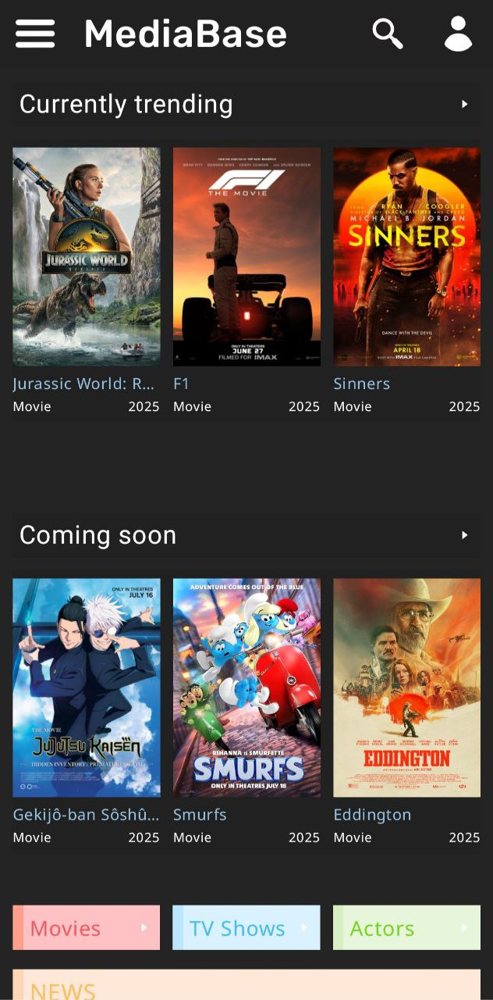
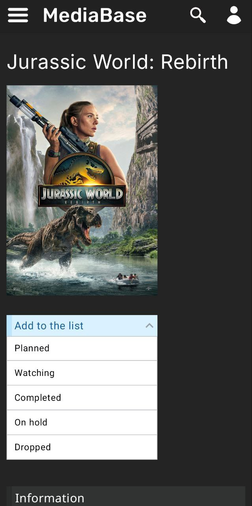
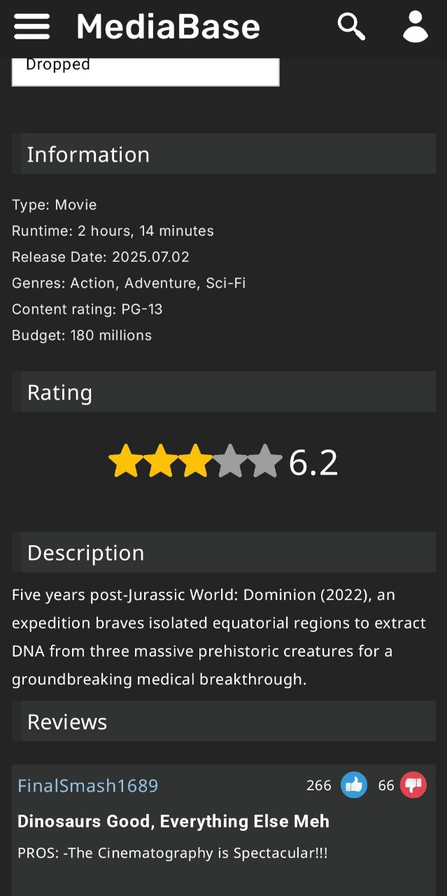
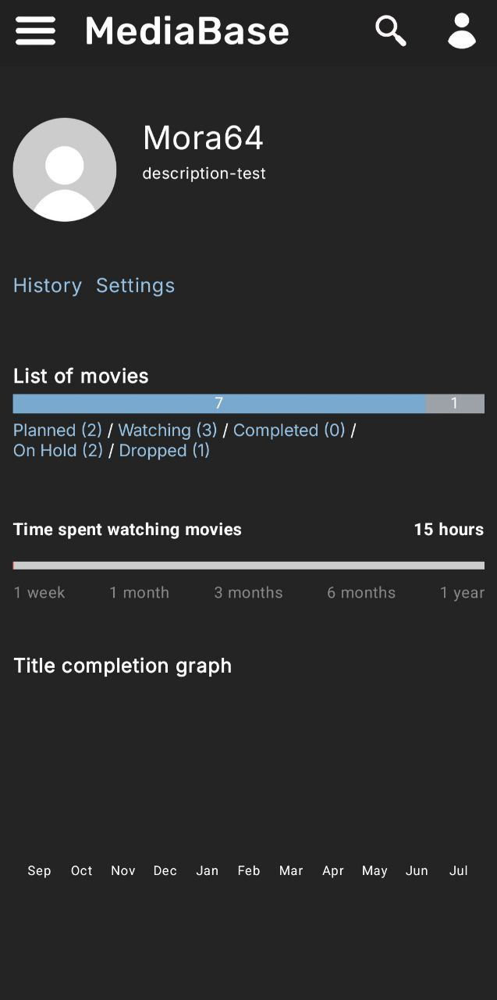
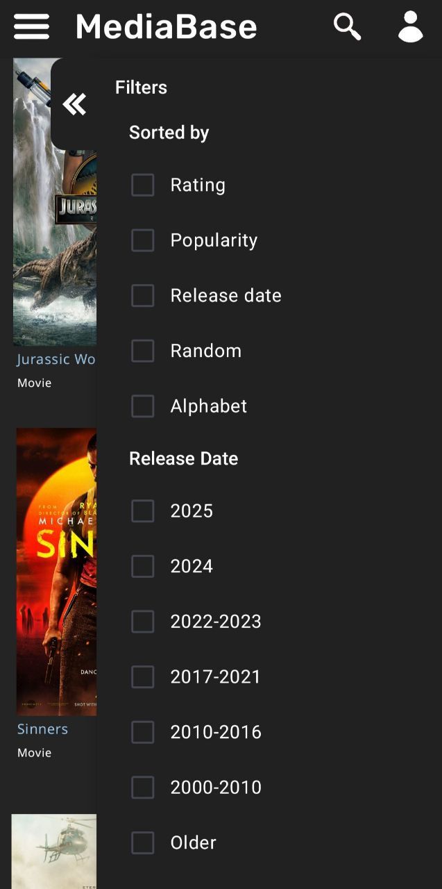
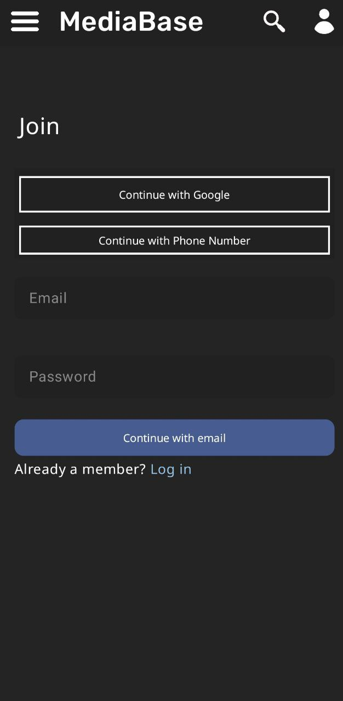

# 🎬 MediaBase

**MediaBase** is an Android application for discovering and tracking movies and TV shows.  
The app allows users to explore currently popular content, top-rated movies and series, read reviews, search for titles, and manage a personal watched list with ratings.

The project is built with a modern Android tech stack and follows **MVVM architecture** principles.

---

## 🚀 Features

🎥 Browse trending and popular movies  
🏆 View top-rated movies and TV shows  
🔍 Search movies and series by title  
📝 Read reviews and descriptions  
⭐ Mark movies as watched  
👍 Rate watched movies and TV shows  
📂 Store watched content locally  
🔥 User data synchronization with Firebase  

---

## 🛠️ Tech Stack

### 📱 Android
- Kotlin  
- Android SDK  
- MVVM Architecture  

### 🌐 Networking
- Retrofit  
- REST API  

### 🧠 Dependency Injection
- Hilt  

### 🗄️ Data Storage
- Room (local database)  
- Firebase  

## 📌 Notes

- The project is actively developed and used as a portfolio application

## 📸 Screenshots

  
  
  
  
  
  

